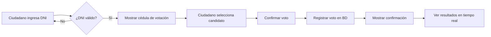

# 🗳️ SISTEMA ELECTORAL PERÚ 2026

Sistema de votación digital para simular las Elecciones Presidenciales del Perú 2026, desarrollado con PHP, MySQL, Bootstrap y Chart.js.


---

## 📋 CARACTERÍSTICAS PRINCIPALES

### ✅ Para Ciudadanos (Votantes)
- ✅ **Login con DNI** (8 dígitos)
- ✅ **Cédula de votación digital** con fotos de candidatos
- ✅ **Un voto por ciudadano** (validación automática)
- ✅ **Proceso de votación intuitivo** (2 minutos)
- ✅ **Confirmación de voto** con comprobante
- ✅ **Verificación en tiempo real**

### 📊 Dashboard de Resultados en Tiempo Real
- ✅ **Gráficos con Chart.js** (barras y estadísticas)
- ✅ **Fotos de candidatos** con conteo de votos
- ✅ **Porcentajes actualizados** cada 5 segundos
- ✅ **Top 3 destacado** con medallas (oro, plata, bronce)
- ✅ **Estadísticas generales** (participación, votos válidos, etc.)
- ✅ **Diseño tipo ONPE** profesional

### 🔐 Seguridad
- ✅ **Voto anónimo y secreto**
- ✅ **Validación de DNI** en padrón electoral
- ✅ **Prevención de votos duplicados**
- ✅ **Registro de IP** y timestamp
- ✅ **Sesiones seguras** con PHP

---

## 🚀 INSTALACIÓN RÁPIDA

### **Requisitos:**
- ✅ Apache 2.4+
- ✅ PHP 8.0+
- ✅ MySQL 8.0+
- ✅ Navegador moderno (Chrome, Firefox, Edge)

### **Paso 1: Configurar Base de Datos**

1. Abre **phpMyAdmin** o tu cliente MySQL
2. Ejecuta el archivo `database_electoral.sql`
3. Esto creará:
   - Base de datos: `db_elecciones_2026`
   - 5 tablas principales
   - 2 vistas para estadísticas
   - 3 procedimientos almacenados
   - Datos de ejemplo (8 partidos + 10 ciudadanos)

```sql
-- En MySQL Workbench o phpMyAdmin, ejecuta:
SOURCE c:/Apache24/htdocs/elecciones_peru_2026/database_electoral.sql;
```

### **Paso 2: Configurar Conexión**

Edita `conexion.php` si es necesario:

```php
$servidor = "localhost";
$usuario = "root";
$clave = "";
$base_datos = "db_elecciones_2026";
```

### **Paso 3: Iniciar Apache y MySQL**

```powershell
# Iniciar servicios
httpd.exe
mysqld.exe
```

### **Paso 4: Acceder al Sistema**

Abre tu navegador y ve a:

```
http://localhost/elecciones_peru_2026/
```

---

## 👥 USUARIOS DE PRUEBA

### **Ciudadanos para Votar (DNI):**

| DNI | Nombre | Departamento |
|-----|--------|--------------|
| `12345678` | JUAN CARLOS PEREZ GARCIA | LIMA |
| `87654321` | MARIA ELENA RODRIGUEZ LOPEZ | AREQUIPA |
| `11223344` | PEDRO JOSE GONZALES MARTINEZ | CUSCO |
| `44332211` | ANA LUCIA FERNANDEZ TORRES | PIURA |
| `55667788` | CARLOS ALBERTO SANCHEZ DIAZ | LIMA |
| `88776655` | ROSA MARIA VARGAS MENDOZA | LA LIBERTAD |
| `99887766` | JOSE LUIS RAMIREZ CASTRO | LAMBAYEQUE |
| `66778899` | CARMEN ROSA FLORES SILVA | JUNIN |
| `77889900` | MIGUEL ANGEL TORRES RUIZ | ICA |
| `00998877` | LUCIA PATRICIA CHAVEZ MORALES | LIMA |

### **Administrador del Sistema:**
```
Usuario: admin
Contraseña: admin123
```

---

## 📂 ESTRUCTURA DEL PROYECTO

```
elecciones_peru_2026/
│
├── 📄 index.php                    # Página de login con DNI
├── 📄 login_electoral.php          # Procesa el login
├── 📄 cedula_votacion.php          # Cédula de votación digital
├── 📄 procesar_voto.php            # Registra el voto
├── 📄 confirmacion_voto.php        # Confirmación de voto exitoso
├── 📄 resultados_publicos.php      # Dashboard de resultados en tiempo real
├── 📄 logout.php                   # Cerrar sesión
├── 📄 conexion.php                 # Conexión a la base de datos
├── 📄 database_electoral.sql       # Script de base de datos
├── 📄 README.md                    # Este archivo
│
├── 📁 assets/
│   ├── 📁 css/
│   ├── 📁 js/
│   └── 📁 img/
│       ├── 📁 candidatos/          # Fotos de candidatos
│       └── 📁 partidos/            # Logos de partidos
│
└── 📁 admin/                       # Panel administrativo (próximamente)
```

---

## 🎨 PARTIDOS POLÍTICOS INCLUIDOS

1. **Fuerza Popular (FP)** - Naranja
2. **Perú Libre (PL)** - Rojo
3. **Renovación Popular (RP)** - Azul Cielo
4. **Alianza para el Progreso (APP)** - Azul
5. **Acción Popular (AP)** - Rojo Carmesí
6. **Partido Morado (PM)** - Morado
7. **Avanza País (APPIS)** - Rosa
8. **Juntos por el Perú (JPP)** - Naranja Rojo

---

## 🔄 FLUJO DEL SISTEMA



---

## 📊 BASE DE DATOS

### **Tablas Principales:**

#### `tbl_ciudadano`
Padrón electoral con todos los ciudadanos habilitados para votar.

```sql
- id (PK)
- dni (UNIQUE, 8 dígitos)
- nombres
- apellido_paterno
- apellido_materno
- fecha_nacimiento
- departamento, provincia, distrito
- ha_votado (0/1)
- fecha_voto
- ip_voto
```

#### `tbl_partido`
Partidos políticos en contienda.

```sql
- id (PK)
- nombre_corto
- nombre_completo
- siglas (UNIQUE)
- logo_url
- color_primario
- orden_cedula
```

#### `tbl_candidato`
Candidatos presidenciales y vicepresidenciales.

```sql
- id (PK)
- partido_id (FK)
- tipo_candidato (PRESIDENTE, VICEPRESIDENTE_1, VICEPRESIDENTE_2)
- dni (UNIQUE)
- nombres, apellido_paterno, apellido_materno
- foto_url
- profesion
- biografia
```

#### `tbl_voto`
Registro de votos (ANÓNIMO).

```sql
- id (PK)
- ciudadano_id (FK, UNIQUE)
- partido_id (FK)
- voto_tipo (VALIDO, BLANCO, NULO)
- fecha_voto
- ip_address
- tiempo_votacion_segundos
```

### **Vistas:**

#### `v_resultados_tiempo_real`
Resultados agregados por partido con porcentajes.

#### `v_estadisticas_elecciones`
Estadísticas generales del proceso electoral.

---

## 🛠️ TECNOLOGÍAS UTILIZADAS

### **Backend:**
- PHP 8.x
- MySQL 8.x con procedimientos almacenados
- Sesiones PHP para autenticación

### **Frontend:**
- HTML5 + CSS3
- Bootstrap 5.3
- Font Awesome 6.0
- Chart.js 4.4 (gráficos)
- JavaScript (actualización en tiempo real)

### **Características Especiales:**
- ✅ Diseño responsive (móvil, tablet, desktop)
- ✅ Animaciones CSS
- ✅ Actualización automática cada 5 segundos
- ✅ Prevención de doble votación
- ✅ Validación de formularios
- ✅ Dashboard estilo ONPE profesional

---

## 📸 CAPTURAS DE PANTALLA

### 1. **Pantalla de Login**
- Login con DNI de 8 dígitos
- Diseño ONPE oficial
- Validación en tiempo real

### 2. **Cédula de Votación**
- Tarjetas con fotos de candidatos
- Información de partidos
- Selección visual con animación

### 3. **Dashboard de Resultados**
- Gráfico de barras con Chart.js
- Conteo de votos en tiempo real
- Top 3 con medallas
- Porcentajes dinámicos
- Estadísticas generales

---

## 🔐 SEGURIDAD IMPLEMENTADA

1. ✅ **Validación de DNI** en padrón electoral
2. ✅ **Un voto por ciudadano** (restricción UNIQUE en BD)
3. ✅ **Voto anónimo** (no se guarda por quién votó)
4. ✅ **Limpieza de datos** con `mysqli_real_escape_string()`
5. ✅ **Prevención de SQL Injection** (procedimientos almacenados)
6. ✅ **Control de sesiones** PHP
7. ✅ **Registro de IP** y timestamp
8. ✅ **Prevención de votos duplicados** en BD

---

## 🚧 MEJORAS FUTURAS

### **Fase 2:**
- [ ] Panel de administración completo
- [ ] Gestión de candidatos desde interfaz
- [ ] Carga masiva de padrón electoral (CSV/Excel)
- [ ] Exportación de resultados a PDF
- [ ] Sistema de auditoría completo

### **Fase 3:**
- [ ] Login con Google OAuth
- [ ] Verificación biométrica (foto)
- [ ] App móvil (React Native)
- [ ] Notificaciones en tiempo real (WebSockets)
- [ ] Dashboard avanzado con más gráficos

### **Seguridad Adicional:**
- [ ] Migrar a `password_hash()` / `password_verify()`
- [ ] Implementar Prepared Statements
- [ ] Tokens CSRF en formularios
- [ ] Encriptación de datos sensibles
- [ ] Certificado SSL (HTTPS)

---

## 📝 CÓMO USAR EL SISTEMA

### **Para Votar:**

1. Ingresa a `http://localhost/elecciones_peru_2026/`
2. Ingresa tu DNI (8 dígitos)
3. El sistema validará que estés en el padrón electoral
4. Selecciona tu candidato presidencial favorito
5. Confirma tu voto
6. Recibirás una confirmación
7. Puedes ver los resultados en tiempo real

### **Para Ver Resultados:**

1. Desde cualquier lugar, ve a:
   ```
   http://localhost/elecciones_peru_2026/resultados_publicos.php
   ```
2. Los resultados se actualizan automáticamente cada 5 segundos
3. Puedes ver:
   - Total de votos por candidato
   - Porcentajes
   - Gráficos estadísticos
   - Top 3 candidatos

---

## ❓ PREGUNTAS FRECUENTES

### **¿Puedo votar más de una vez?**
No, el sistema valida que cada DNI solo pueda votar UNA vez.

### **¿Mi voto es secreto?**
Sí, el sistema NO guarda por quién votaste. Solo registra que ejerciste tu derecho al voto.

### **¿Puedo ver los resultados sin votar?**
Sí, los resultados son públicos y se pueden consultar en cualquier momento.

### **¿Cómo agrego más candidatos?**
Debes insertar datos en las tablas `tbl_partido` y `tbl_candidato` directamente en MySQL.

### **¿Puedo cambiar mi voto?**
No, una vez confirmado el voto, NO se puede modificar.

---

## 🤝 CONTRIBUCIONES

Este es un proyecto educativo de simulación electoral. Si deseas contribuir:

1. Fork el proyecto
2. Crea una rama (`git checkout -b feature/nueva-funcionalidad`)
3. Commit tus cambios (`git commit -am 'Agregar nueva funcionalidad'`)
4. Push a la rama (`git push origin feature/nueva-funcionalidad`)
5. Abre un Pull Request

---

## 📄 LICENCIA

Este proyecto es de código abierto bajo la licencia MIT.

---

## 👨‍💻 AUTOR

Sistema desarrollado como proyecto educativo para simular el proceso electoral peruano.

**Tecnologías:** PHP, MySQL, Bootstrap, Chart.js  
**Año:** 2024  
**Propósito:** Educativo y de demostración

---

## 📞 SOPORTE

Para preguntas o problemas:
- 📧 Email: soporte@ejemplo.com
- 🐛 Issues: GitHub Issues

---

## 🎉 AGRADECIMIENTOS

- **ONPE** por la inspiración del diseño
- **Bootstrap** por el framework CSS
- **Chart.js** por los gráficos
- **Font Awesome** por los iconos

---

## 📌 NOTAS IMPORTANTES

⚠️ **ADVERTENCIA:** Este es un sistema de SIMULACIÓN con fines educativos. NO debe usarse para elecciones reales sin implementar medidas de seguridad adicionales.

✅ **Recomendaciones para producción:**
- Implementar HTTPS
- Usar prepared statements
- Agregar autenticación de dos factores
- Implementar logging completo
- Realizar auditorías de seguridad
- Usar password_hash() en lugar de MD5

---

**¡Gracias por usar el Sistema Electoral Perú 2026!** 🗳️🇵🇪
